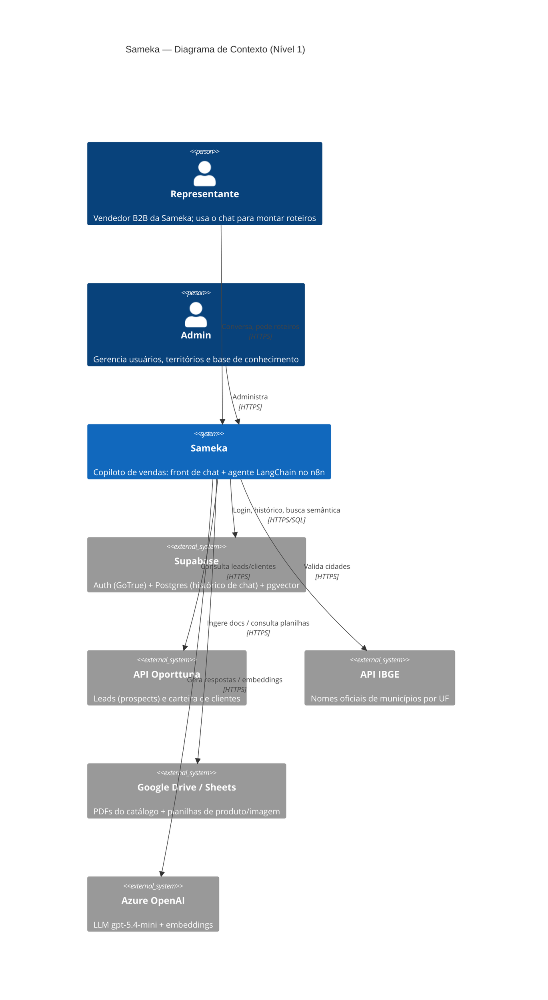
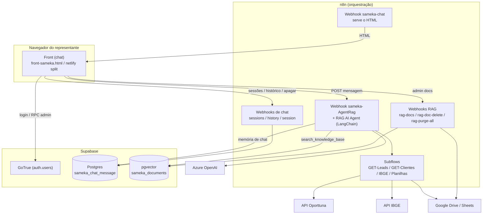
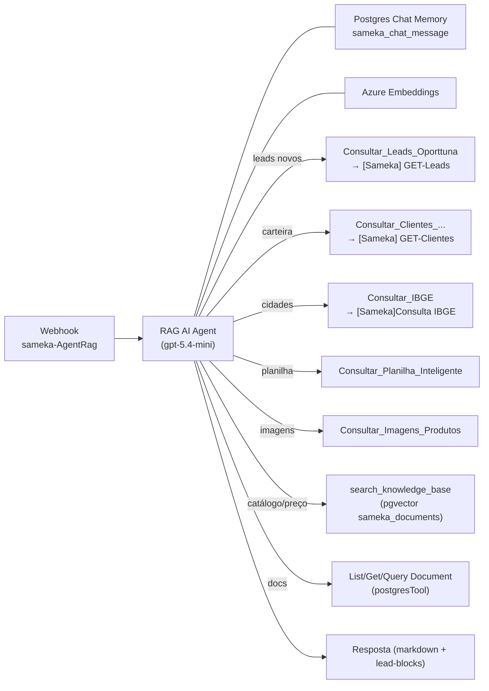
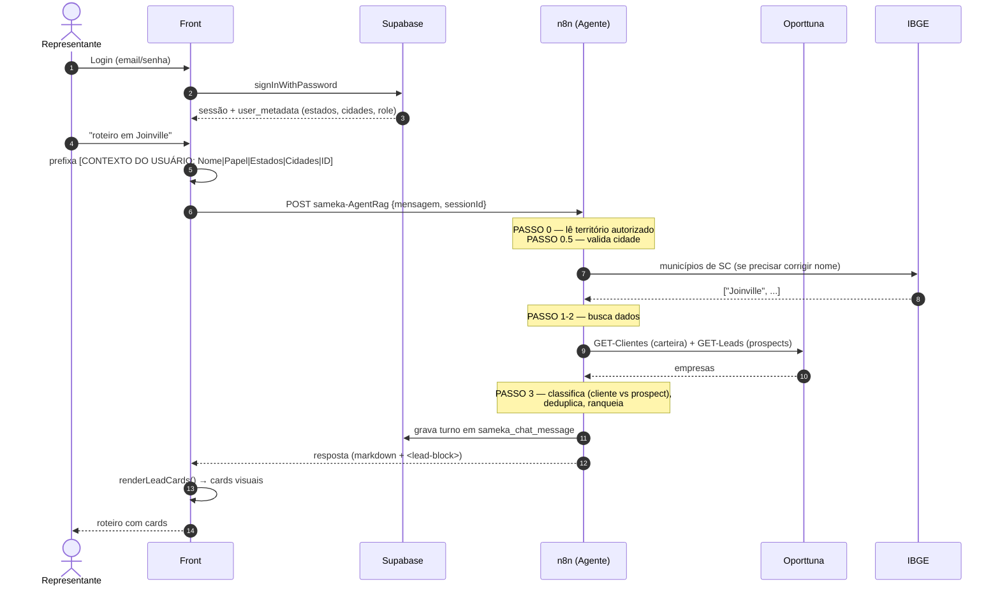
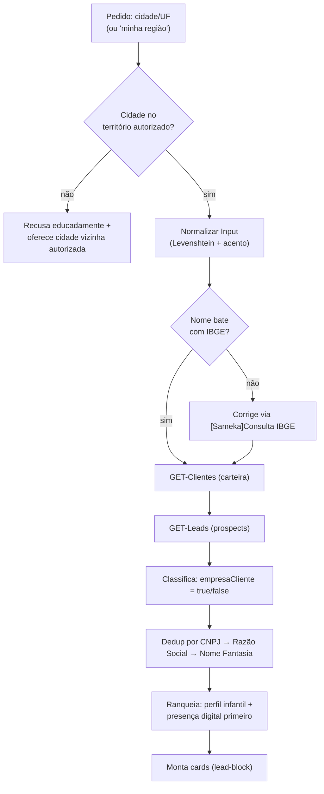
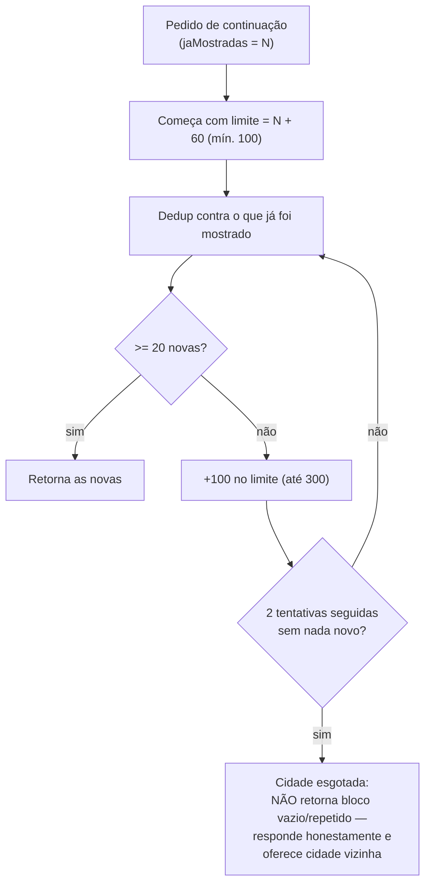
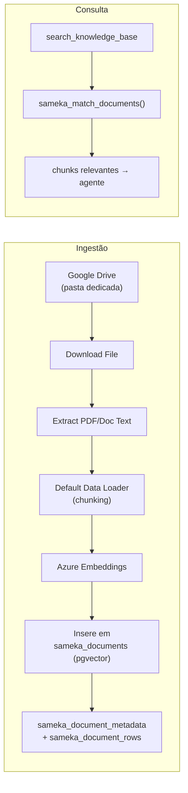
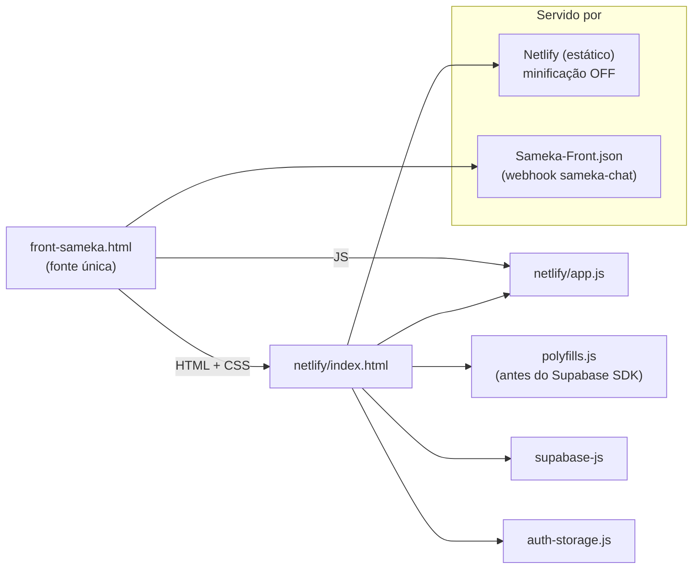
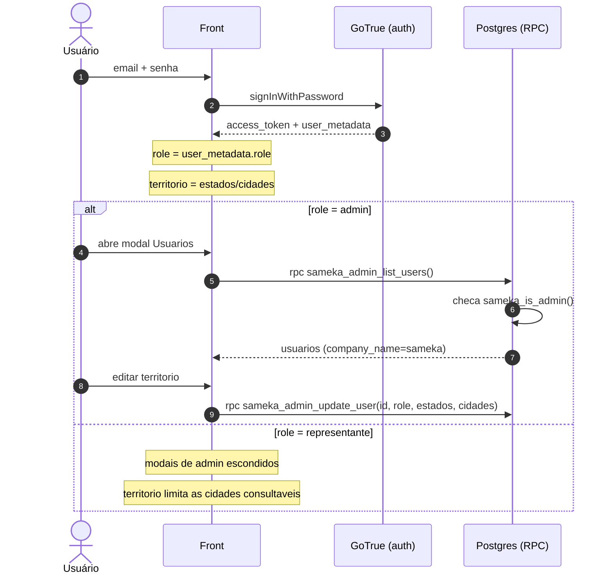
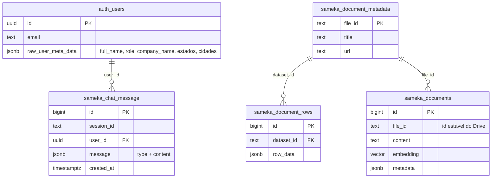

# Arquitetura — Sameka

Documento técnico detalhado de **como tudo funciona**: as 5 camadas, os fluxos de mensagem, o pipeline de leads, a auth, o RAG e o padrão de entrega dupla do front. Todos os diagramas são **Mermaid** (sem ASCII art).

Índice:

- [1. Visão geral (C4 — Contexto)](#1-visão-geral-c4--contexto)
- [2. Containers (C4 — Nível 2)](#2-containers-c4--nível-2)
- [3. Camada 1 — Banco / Auth (Supabase)](#3-camada-1--banco--auth-supabase)
- [4. Camada 2 — Orquestração + Agente (n8n)](#4-camada-2--orquestração--agente-n8n)
- [5. Fluxo de uma mensagem (sequência)](#5-fluxo-de-uma-mensagem-sequência)
- [6. Pipeline de leads (o coração do produto)](#6-pipeline-de-leads-o-coração-do-produto)
- [7. Camada RAG / Catálogo](#7-camada-rag--catálogo)
- [8. Camada Front (monolito + split)](#8-camada-front-monolito--split)
- [9. Autenticação e papéis](#9-autenticação-e-papéis)
- [10. Modelo de dados](#10-modelo-de-dados)
- [11. Endpoints (webhooks)](#11-endpoints-webhooks)
- [12. Decisões e regras invioláveis](#12-decisões-e-regras-invioláveis)

---

## 1. Visão geral (C4 — Contexto)

---

## 2. Containers (C4 — Nível 2)

**Princípio:** o front **só** fala com webhooks do n8n e com o Supabase (auth). Toda a lógica de negócio (busca de leads, RAG, ranking) vive no n8n. As APIs externas (Oporttuna, IBGE, Google, Azure) são chamadas **somente** pelo n8n.

---

## 3. Camada 1 — Banco / Auth (Supabase)

Migrations em [`migrations/`](./migrations). Convenções: prefixo `sameka_`; toda RPC é `SECURITY DEFINER SET search_path = auth, public`; cada arquivo termina com `NOTIFY pgrst, 'reload schema'` (recarrega cache do PostgREST). **Não há tabela `profiles`** — os dados do usuário vivem em `auth.users.raw_user_meta_data` (JSONB): `full_name`, `role`, `company_name`, `estados`, `cidades`.

| Migration                      | O que faz                                                                                                                                                             |
| ------------------------------ | --------------------------------------------------------------------------------------------------------------------------------------------------------------------- |
| `001_user_crud_functions.sql`  | RPCs base sobre `auth.users`: `sameka_admin_list_users()`, `sameka_admin_confirm_user(uuid)`, `sameka_admin_update_user(uuid,text)`, `sameka_admin_delete_user(uuid)` |
| `002_add_roles.sql`            | Adiciona `role` à listagem e parâmetro `p_role` ao update                                                                                                             |
| `003_admin_guards.sql`         | Cria `sameka_is_admin()` e adiciona guard `IF NOT sameka_is_admin() THEN RAISE` nas 4 RPCs                                                                            |
| `004_add_company_name.sql`     | Multi-tenant leve: filtra usuários por `company_name='sameka'`; `sameka_is_admin()` checa company                                                                     |
| `005_add_coverage_areas.sql`   | Territórios: colunas/params `estados` e `cidades` (JSONB); `sameka_admin_update_user(uuid,text,text,jsonb,jsonb)`                                                     |
| `006_prevent_self_delete.sql`  | Guard `IF p_user_id = auth.uid() THEN RAISE` no delete                                                                                                                |
| `007_add_user_to_chat.sql`     | Adiciona `user_id UUID` em `sameka_chat_message` + índice; trigger `trg_set_chat_user_id()` extrai o UUID do marcador `[CONTEXTO DO USUÁRIO: ID="..."]`               |
| `008_backfill_user_id.sql`     | Backfill único do `user_id` em linhas antigas                                                                                                                         |
| `009_fix_auth_null_tokens.sql` | Corrige colunas de token `NULL` em `auth.users` (bug do GoTrue que causa HTTP 500 no login)                                                                           |

Setup equivalente sem rodar SQL manual: o workflow [`Sameka-DB-Schema-Setup.json`](./workspaces/Sameka-DB-Schema-Setup.json) recria o schema de forma **idempotente** (`continueOnFail: true`), cobrindo o equivalente às migrations 001–007 (estratégia **Tier B** — setup pelo n8n, sem apagar dados).

---

## 4. Camada 2 — Orquestração + Agente (n8n)

O agente principal é o node **RAG AI Agent** (LangChain) em [`Sameka-Agent-IA-copy.json`](./workspaces/Sameka-Agent-IA-copy.json), exposto no webhook `sameka-AgentRag`. Ele recebe a mensagem (com o `[CONTEXTO DO USUÁRIO: ...]` prefixado pelo front), executa um `systemMessage` longo (protocolo PASSO 0 → 4) e escolhe ferramentas.

**Ferramentas do agente** (cada uma é um subflow ou tool node):

| Tool                                                           | Destino                                                | Uso                                |
| -------------------------------------------------------------- | ------------------------------------------------------ | ---------------------------------- |
| `Consultar_Leads_Oporttuna`                                    | `[Sameka] GET-Leads`                                   | Prospects novos por cidade/UF      |
| `Consultar_Clientes_Sameka_API_Oporttuna`                      | `[Sameka] GET-Clientes`                                | Clientes ativos (carteira)         |
| `Consultar_IBGE`                                               | `[Sameka]Consulta IBGE`                                | Lista oficial de municípios por UF |
| `Consultar_Planilha_Inteligente`                               | subflow planilha                                       | Busca em planilha de produtos      |
| `Consultar_Imagens_Produtos`                                   | subflow imagens                                        | Imagens de produto                 |
| `search_knowledge_base`                                        | pgvector `sameka_documents` / `sameka_match_documents` | Busca semântica no catálogo        |
| `List Documents` / `Get File Contents` / `Query Document Rows` | postgresTool                                           | Metadados/linhas de docs indexados |

Workflows auxiliares de manutenção no mesmo JSON: **PruneWebhook** (`sameka-prune-history` → apaga mensagens a partir de um id, usado ao editar) e **Test Connection** (`sameka_health`).

---

## 5. Fluxo de uma mensagem (sequência)

---

## 6. Pipeline de leads (o coração do produto)

O agente trata **duas fontes Oporttuna** e nunca inventa empresas:

- `GET-Clientes` → **carteira** (clientes já ativos da Sameka).
- `GET-Leads` → **prospects** (potenciais clientes novos).

### Protocolo "mais opções" (continuação / escalonamento)

A API Oporttuna devolve sempre as **mesmas** empresas no topo (ranking ICP fixo). Sem cuidado, "mais opções" repetiria os mesmos cards e o front (que deduplica) mostraria **zero**. O protocolo no `systemMessage` resolve assim:

---

## 7. Camada RAG / Catálogo

Ingestão de PDFs do Google Drive, vetorização no pgvector e consulta semântica. Workflow [`Sameka-RAG.json`](./workspaces/Sameka-RAG.json).

**Identidade estável:** cada documento mantém o `file_id` do Drive como chave; atualizar um doc usa `files.update` (mesmo `file_id`), nunca `files.delete`. Endpoints admin: `sameka-rag-docs` (listar), `sameka-rag-doc-delete` (remover), `sameka-rag-purge-all` (purgar). Planilhas de produto/imagem são consultadas por subflows separados (Google Sheets), não pelo vetor.

---

## 8. Camada Front (monolito + split)

A fonte única é o monolito [`front-sameka.html`](./front-sameka.html) (~7074 linhas). Para hosting estático, ele é **fatiado** em [`netlify/`](./netlify). Toda mudança precisa ficar **idêntica** nos dois lados.

**Ordem de carregamento (crítica):** `polyfills.js` → `supabase-js` → `auth-storage.js` → `app.js`. Os polyfills preparam `localStorage`/`sessionStorage`/`navigator.locks` para funcionar dentro de iframe **antes** do SDK do Supabase carregar. O `auth-storage.js` implementa a cascata de persistência de sessão: **localStorage → cookie → memória**.

> O `netlify.toml` mantém **toda minificação/bundling desligada** (`skip_processing`), porque o minificador quebra o JS inline e o split.

Principais áreas de função no front: `buildAuthStorage()`, `sendMessage()/fetchHistory()/fetchSessions()`, `renderSessionList()`, `renderLeadCards()/processLeadBlocks()`, `processProductImageBlocks()`, `renderMessage()` (marked + highlight.js), quick-actions (`handleMinhaRegiao`, `generateRoteiroForCity`, `qaCheckCityAccess`), admin de usuários (`loadUsersPage/openEditUser/openDeleteUser` via RPC) e admin de docs RAG (`showRagDocsPage/uploadRagDoc/purgeAllRagDocs`).

---

## 9. Autenticação e papéis

Pontos-chave:

- Sessão persiste mesmo em iframe via cascata `localStorage → cookie → memória` (`auth-storage.js`).
- RPCs admin são `SECURITY DEFINER` com guard `sameka_is_admin()` (defesa no servidor, não só na UI).
- Admin não pode se autodeletar (`006_prevent_self_delete.sql`).

---

## 10. Modelo de dados

> O `user_id` em `sameka_chat_message` é preenchido automaticamente pelo trigger `trg_set_chat_user_id()`, que extrai o UUID do marcador `[CONTEXTO DO USUÁRIO: ID="..."]` nas mensagens humanas e propaga para as respostas da IA na mesma sessão.

---

## 11. Endpoints (webhooks)

| Path (após `…/webhook/`) | Método   | Workflow                   | Função                                     |
| ------------------------ | -------- | -------------------------- | ------------------------------------------ |
| `sameka-AgentRag`        | POST     | Sameka-Agent-IA-copy       | Mensagem ao agente                         |
| `sameka-sessions`        | GET      | Sameka-Chat-GET-Sessions   | Lista sessões do usuário                   |
| `sameka-history`         | GET      | Sameka-Chat-GET-History    | Histórico de uma sessão                    |
| `sameka-session`         | DELETE   | Sameka-Chat-DELETE-Session | Apaga sessão                               |
| `sameka-prune-history`   | POST     | Sameka-Agent-IA-copy       | Apaga mensagens a partir de um id (editar) |
| `sameka-chat`            | GET      | Sameka-Front               | Serve o HTML do front                      |
| `sameka-rag-docs`        | GET/POST | Sameka-RAG                 | Lista docs do RAG                          |
| `sameka-rag-doc-delete`  | POST     | Sameka-RAG                 | Remove doc do RAG                          |
| `sameka-rag-purge-all`   | POST     | Sameka-RAG                 | Purga todo o RAG                           |
| `sameka-index-drive`     | POST     | Sameka-RAG                 | Indexa novo doc do Drive                   |
| `sameka_health`          | GET      | Sameka-Agent-IA-copy       | Healthcheck                                |

---

## 12. Decisões e regras invioláveis

| Decisão                                       | Razão                                                                |
| --------------------------------------------- | -------------------------------------------------------------------- |
| Toda lógica no n8n; front "burro"             | Trocar prompt/fonte sem redeploy do front; segredos longe do cliente |
| Metadata-first (sem `profiles`)               | Menos joins; território e role viajam no JWT                         |
| RPC `SECURITY DEFINER` + `sameka_is_admin()`  | Autorização no banco, não confiando só na UI                         |
| `file_id` do Drive como chave do RAG          | Atualizar doc sem perder vínculos (identidade estável)               |
| Monolito como fonte única + split idempotente | Edição em um lugar; hosting estático sem build                       |
| Minificação OFF no Netlify                    | Minificador quebra JS inline e a ordem de scripts                    |

**Proibições absolutas:**

- ❌ `DROP ... CASCADE` em migrations/workflows.
- ❌ `ON DELETE CASCADE` em FK para `auth.users`.
- ❌ `files.delete` do Google Drive (use `files.update`).
- ❌ `service_role` / senha do Postgres no front ou Netlify (somente anon key).
- ❌ Inventar empresas/cidades — leads só das APIs Oporttuna; cidades validadas pelo IBGE.
