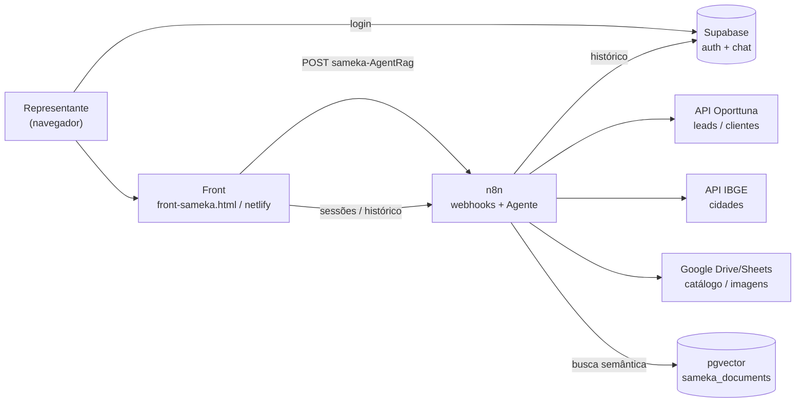

# Sameka — Copiloto Estratégico de Vendas

> Copiloto de IA (chat) que ajuda **representantes comerciais B2B** da Sameka (calçados de couro para bebê) a montar **roteiros de vendas** com leads qualificados, consultar o **catálogo de produtos** e gerenciar a base de conhecimento (RAG).

Este repositório é a **implementação de referência** do padrão "Sameka": **n8n workflows** (orquestração + agente LangChain) + **front HTML/Netlify** (chat) + **Supabase** (auth + histórico) + **RAG** (catálogo). Serve de template para clonar agentes semelhantes.

Para a arquitetura técnica detalhada (diagramas, fluxos, decisões), veja [ARCHITECTURE.md](./ARCHITECTURE.md).

---

## Sobre

O representante abre o chat, faz login (Supabase), e pede coisas como _"roteiro em Joinville"_, _"minha região"_, _"mostre o catálogo"_. O agente:

1. Identifica o **território autorizado** do representante (estados/cidades vindos do metadata do usuário).
2. Valida/corrige o nome da cidade (via IBGE) para evitar erro de digitação.
3. Busca **clientes ativos** (carteira Sameka) e **prospects novos** (base Oporttuna) pelas APIs.
4. Deduplica, ranqueia (perfil infantil + presença digital primeiro) e devolve **cards visuais** de empresas.
5. Para perguntas de catálogo/preço/política, consulta o **RAG** (PDFs indexados) e planilhas de produto.

A interface, o agente e os dados são desacoplados: o **front** só fala com webhooks do **n8n**; o n8n orquestra o **agente LLM**, as **APIs Oporttuna**, o **IBGE**, o **Google Drive/Sheets** e o **Supabase/Postgres**.

---

## Camadas (5)

| Camada                     | Pasta / Arquivo                            | Responsabilidade                                                      | Tech                                    |
| -------------------------- | ------------------------------------------ | --------------------------------------------------------------------- | --------------------------------------- |
| **Banco / Auth**           | [`migrations/`](./migrations)              | Schema de chat, RPCs admin (`SECURITY DEFINER`), roles, territórios   | Supabase / Postgres                     |
| **Orquestração + Agente**  | [`workspaces/`](./workspaces)              | Agente LangChain, CRUD de chat, RAG, subflows de leads/IBGE/planilhas | n8n                                     |
| **Front (monolito)**       | [`front-sameka.html`](./front-sameka.html) | Chat, login, sidebar de sessões, modais de admin (usuários/docs)      | HTML + JS vanilla                       |
| **Front (split estático)** | [`netlify/`](./netlify)                    | Versão fatiada do monolito para hosting estático                      | Netlify                                 |
| **RAG / Catálogo**         | parte de `workspaces/` + Drive             | Ingestão de PDFs, vetorização, planilhas de produto/imagem            | Supabase pgvector + Google Drive/Sheets |

---

## Stack

| Dimensão      | Tecnologia                                                                 |
| ------------- | -------------------------------------------------------------------------- |
| Orquestração  | **n8n** (LangChain Agent node)                                             |
| LLM           | Azure OpenAI (`gpt-5.4-mini`)                                              |
| Embeddings    | Azure OpenAI `text-embedding-3-small`                                      |
| Vector store  | Supabase pgvector (`sameka_documents`)                                     |
| Auth          | Supabase GoTrue (`signInWithPassword`, RPCs admin)                         |
| Banco         | PostgreSQL (Supabase) — tabela `sameka_chat_message`                       |
| Front         | HTML + JS vanilla (marked.js, highlight.js, lucide icons, supabase-js)     |
| Hosting front | Netlify (estático) **ou** n8n servindo o HTML (`Sameka-Front.json`)        |
| APIs externas | Oporttuna (leads/clientes), IBGE (cidades), Google Drive/Sheets (catálogo) |

---

## Pré-requisitos

- **n8n** (self-hosted) com as credenciais configuradas:
  - `Supabase account` / `Supabase_database` (Postgres)
  - `Azure Open AI account` (chat + embeddings)
  - Google Drive / Google Sheets OAuth
  - Token/tenant Oporttuna
- **Supabase** (projeto Postgres + GoTrue).
- Servidor estático (Netlify) **ou** usar o node HTML do n8n para servir o front.

---

## Setup

### 1. Banco (Supabase)

Rode as migrations **na ordem** no SQL Editor do Supabase Studio (ver [`migrations/`](./migrations)):

```text
001 → 002 → 003 → 004 → 005 → 006 → 007 → 008 → 009
```

Cada arquivo é **idempotente** e termina com `NOTIFY pgrst, 'reload schema'` (recarrega o cache do PostgREST). Detalhes de cada migration em [ARCHITECTURE.md](./ARCHITECTURE.md#camada-1--banco--auth-supabase).

Crie o admin inicial:

```powershell
# Cria admin@sameka.com.br via GoTrue e imprime o SQL de confirmação
.\004_seed.ps1
```

> Se um login novo retornar erro `{}` (HTTP 500), rode `migrations/009_fix_auth_null_tokens.sql` — corrige colunas de token `NULL` em `auth.users` (bug clássico do GoTrue).

### 2. Workflows (n8n)

Importe os JSONs de [`workspaces/`](./workspaces) no n8n e **religue as credenciais** em cada node (os IDs de credencial não são portáveis entre instâncias). O fluxo principal é [`Sameka-Agent-IA-copy.json`](./workspaces/Sameka-Agent-IA-copy.json) (node **RAG AI Agent**).

### 3. Front

- **Opção A (Netlify):** publique a pasta [`netlify/`](./netlify) (já fatiada). O `netlify.toml` **desliga toda minificação** (ela quebra o JS inline).
- **Opção B (n8n):** o workflow [`Sameka-Front.json`](./workspaces/Sameka-Front.json) serve o monolito `front-sameka.html` no path `sameka-chat`.

Edições de front são feitas **sempre no monolito** `front-sameka.html` e sincronizadas para o split (ver skill `n8n-front-injection`).

---

## Variáveis / Endpoints

O front aponta para uma base de webhooks do n8n e para o Supabase (constantes no topo do `<script>` em `front-sameka.html`):

| Constante             | Valor                                           | Uso                                        |
| --------------------- | ----------------------------------------------- | ------------------------------------------ |
| `API_BASE`            | `https://longflatworm-n8n.cloudfy.live/webhook` | Base dos webhooks n8n                      |
| `CHAT_URL`            | `${API_BASE}/sameka-AgentRag`                   | Envia mensagem ao agente                   |
| `SESSIONS_URL`        | `${API_BASE}/sameka-sessions`                   | Lista sessões do usuário                   |
| `HISTORY_URL`         | `${API_BASE}/sameka-history`                    | Histórico de uma sessão                    |
| `DELETE_URL`          | `${API_BASE}/sameka-session`                    | Apaga sessão                               |
| `PRUNE_URL`           | `${API_BASE}/sameka-prune-history`              | Apaga mensagens a partir de um id (editar) |
| `UPLOAD_URL`          | `${API_BASE}/sameka-index-drive`                | Sobe doc p/ RAG                            |
| `RAG_DOCS_LIST_URL`   | `${API_BASE}/sameka-rag-docs`                   | Lista docs do RAG                          |
| `RAG_DOCS_DELETE_URL` | `${API_BASE}/sameka-rag-doc-delete`             | Remove doc do RAG                          |
| `RAG_PURGE_URL`       | `${API_BASE}/sameka-rag-purge-all`              | Purga todo o RAG                           |
| `HEALTH_URL`          | `${API_BASE}/sameka_health`                     | Healthcheck                                |
| `SUPABASE_URL`        | `https://longflatworm-supabase.cloudfy.live`    | Auth + RPCs                                |
| `SUPABASE_ANON_KEY`   | (anon, embutida)                                | Chave pública do front                     |

> **Segurança:** apenas a **anon key** pode ficar no front. A `service_role` e a senha do Postgres **nunca** entram no front/Netlify — ficam só nas credenciais do n8n (marcadas como `__FILL_ME__` neste repo).

---

## Como funciona (visão rápida)



Fluxo detalhado de uma mensagem, dedup, escalonamento de "mais opções" e validação de cidade: ver [ARCHITECTURE.md](./ARCHITECTURE.md).

---

## Estrutura do repositório

```text
sameka/
├── front-sameka.html          # Monolito do chat (fonte única do front)
├── netlify/                   # Split estático do monolito
│   ├── index.html             # Esqueleto + carregamento de scripts
│   ├── polyfills.js           # Polyfills de storage/locks (antes do Supabase SDK)
│   ├── auth-storage.js        # Adapter de sessão: localStorage → cookie → memória
│   └── app.js                 # Lógica da aplicação (idêntica ao JS do monolito)
├── netlify.toml               # Hosting: TODA minificação desligada
├── workspaces/                # Workflows n8n (agente, chat CRUD, RAG, subflows)
│   ├── Sameka-Agent-IA-copy.json   # ★ Agente principal (RAG AI Agent + tools)
│   ├── Sameka-Chat-GET-Sessions.json
│   ├── Sameka-Chat-GET-History.json
│   ├── Sameka-Chat-DELETE-Session.json
│   ├── Sameka-Front.json           # Serve o HTML do front
│   ├── Sameka-RAG.json             # Ingestão/vetorização de docs (Drive)
│   ├── Sameka-DB-Schema-Setup.json # Setup idempotente de schema (Tier B)
│   ├── [Sameka] GET-Leads.json            # Subflow: prospects Oporttuna
│   ├── [Sameka] GET-Clientes.json         # Subflow: carteira Sameka (API)
│   ├── [Sameka] GET-Clientes-Carteira-RAG.json
│   ├── [Sameka]Consulta IBGE.json         # Subflow: cidades oficiais por UF
│   └── [Sameka] Sub-fluxo_ *.json         # Planilhas inteligentes / imagens / Drive
├── migrations/                # SQL Supabase (RPCs SECURITY DEFINER, roles, territórios)
│   ├── 001_user_crud_functions.sql ... 009_fix_auth_null_tokens.sql
│   └── 008_LEIA-ME.md
├── docs/                      # PRDs e plano (fonte única Oporttuna, qualidade, enriquecimento)
├── 004_seed.ps1              # Cria admin inicial (GoTrue)
├── 005_run_migration_008.ps1 # Executa backfill da migration 008
├── openapi-inteligencia-negocio.yaml      # Spec da API Oporttuna (leads)
└── oporttuna-inteligencia-comercial.yaml  # Spec da API Oporttuna (comercial)
```

---

## Operações comuns

| Tarefa                                    | Onde                                                                                                |
| ----------------------------------------- | --------------------------------------------------------------------------------------------------- |
| Mudar o comportamento do agente (prompt)  | `workspaces/Sameka-Agent-IA-copy.json` → node **RAG AI Agent** → `parameters.options.systemMessage` |
| Mudar a UI do chat                        | `front-sameka.html` (e sincronizar para `netlify/`)                                                 |
| Adicionar/remover doc do RAG              | Modal "Documentos" no front (admin) → webhooks `sameka-rag-*`                                       |
| Criar/editar usuário e território         | Modal "Usuários" no front (admin) → RPCs `sameka_admin_*`                                           |
| Ajustar resolução de cidade (typo/acento) | Subflows `GET-Leads` / `GET-Clientes` (node _Normalizar Input_) + `[Sameka]Consulta IBGE`           |

> **Editar o JSON do agente:** use Node.js (`JSON.parse`/`JSON.stringify`), preservando o BOM e os finais de linha **CRLF** (`\r\n`) do `systemMessage`. `ConvertTo-Json` do PowerShell 5.1 **trava** em arquivos com `[` no nome.

---

## Convenções e regras invioláveis

- Prefixo `sameka_` em tabelas/funções; RPCs admin sempre `SECURITY DEFINER` com guard `sameka_is_admin()`.
- **Nunca** `DROP ... CASCADE`, `ON DELETE CASCADE` para `auth.users`, ou `files.delete` do Drive.
- **Nunca** colocar `service_role` / senha Postgres no front ou no Netlify.
- Edições de front devem ficar **idênticas** entre `front-sameka.html` e o split em `netlify/` (HTML/CSS em `index.html`, JS em `app.js`).
- Leads vêm **só** das 2 APIs Oporttuna; RAG/planilhas são **só** para catálogo.

---

## Contribuindo

1. Faça a mudança no artefato correto (prompt no JSON do agente, UI no monolito, SQL em nova migration numerada).
2. Valide: JSON do agente deve parsear (`node -e "JSON.parse(...)"`, 24 nodes); front sem erros de lint; SQL idempotente.
3. Mantenha o split do Netlify em sincronia com o monolito.
