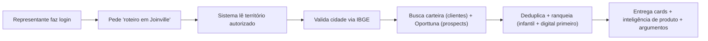
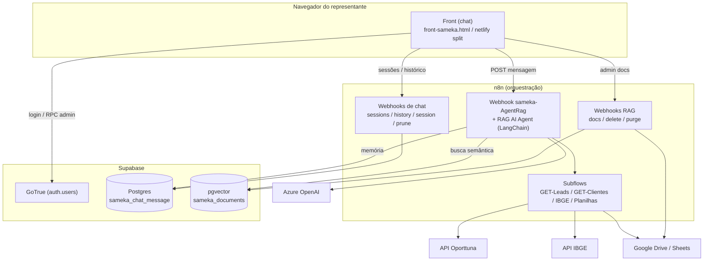
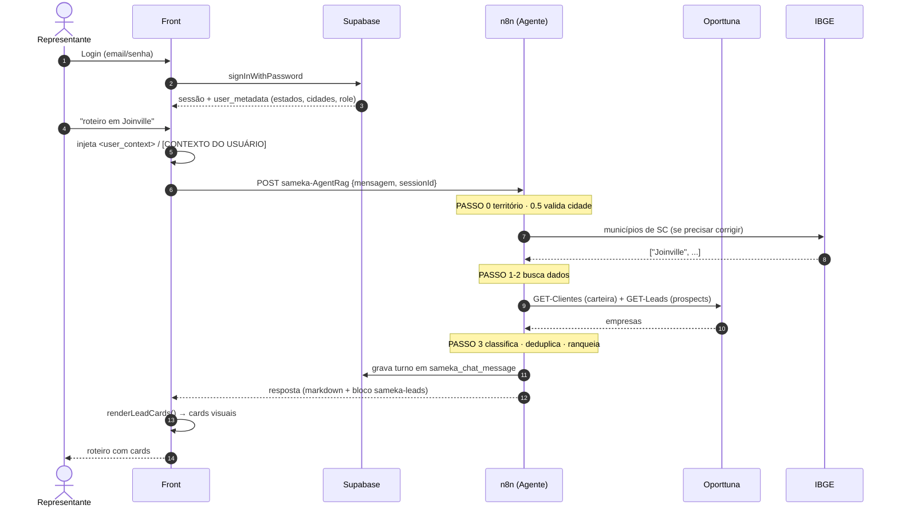

# Documentação Técnica e de Negócio — Sameka

> Copiloto Estratégico de Vendas — calçados de couro premium para bebê.
> Documento de transferência de conhecimento: cobre **negócio** e **desenvolvimento**.

---

## Sumário Executivo

O **Sameka** é um copiloto de IA (chat) de uso **interno** que ajuda **representantes comerciais B2B** da marca Sameka (calçados de couro premium para bebê) a montar **roteiros de visita física** com leads qualificados, consultar o **catálogo de produtos** (preços, cores, numerações, prazos) e preparar **argumentos de venda** para reuniões presenciais.

O representante abre o chat, faz login, e pede coisas como _"roteiro em Joinville"_, _"minha região"_ ou _"mostre o catálogo"_. O sistema identifica o **território autorizado** do usuário, valida a geografia (IBGE), busca **clientes ativos** e **prospects novos** nas APIs Oporttuna, deduplica/ranqueia e devolve **cards visuais** de empresas, enriquecidos com dados reais de produto.

**Para quem:** representantes de campo (perfil `representante`) e administradores (`admin`) que gerenciam usuários, territórios e base de conhecimento.

**Valor:** elimina roteiros com empresas mortas/fora de perfil, garante classificação correta cliente×prospect e evita inventar dados de catálogo.

**Stack em uma frase:** front HTML/JS vanilla → webhooks **n8n** (agente LangChain + Azure OpenAI) → **Supabase** (auth, histórico, pgvector) + APIs **Oporttuna/IBGE/Google**.

---

## Parte I — Visão de Negócio

### 1. Propósito e problema resolvido

**Problema:** roteiros de prospecção tradicionais traziam empresas desatualizadas, calçado adulto e lojas sem presença digital — o representante perdia tempo visitando pontos sem aderência ao produto.

**Solução:** copiloto que usa **dados vivos** (API Oporttuna, alimentada por Receita Federal/Observatório) com ranking ICP automático de varejo infantil, valida nomes de cidade (IBGE, à prova de erro de digitação) e enriquece cada lead com referências reais de catálogo.

**Identidade do produto (guard rails):**

- É um copiloto de **varejo físico** — NÃO é consultor de e-commerce nem marketing digital.
- "Roteiro" = rota de **visita porta-a-porta** a lojas físicas (boutiques, lojas de shopping, lojas de bebê).
- Não fala com consumidor final; o usuário é sempre um colaborador interno.

### 2. Atores e papéis

| Ator          | Papel (`role`)  | O que pode fazer                                                                                                                                                                                  |
| ------------- | --------------- | ------------------------------------------------------------------------------------------------------------------------------------------------------------------------------------------------- |
| Representante | `representante` | Gerar roteiros/leads **apenas** nas cidades/estados do seu território; consultar catálogo; preparar argumentos.                                                                                   |
| Administrador | `admin`         | Tudo do representante **sem restrição de território** (acesso nacional) + gerenciar usuários (criar, confirmar, editar papel/território, excluir) e a base RAG (upload, listar, remover, purgar). |
| Sistema (IA)  | —               | Orquestra a busca, classifica cliente×prospect, deduplica, ranqueia e formata os cards.                                                                                                           |

> [!NOTE]
> Sem login real, o agente assume `admin` (acesso nacional). O território vem do `raw_user_meta_data` do usuário no Supabase (campos `estados` e `cidades`).

### 3. Jornadas / fluxos principais

**Jornada A — Roteiro de vendas por cidade**



Passo a passo:

1. O representante envia uma cidade/região (mesmo com erro de digitação).
2. O sistema confere se a cidade está no **território autorizado**; se não, recusa educadamente.
3. Valida/corrige o nome da cidade pela **API IBGE** (a API de leads é sensível a acento).
4. Busca **clientes ativos** (carteira) e **prospects novos** (Oporttuna) em paralelo.
5. Deduplica por CNPJ → Razão Social → Nome Fantasia; ranqueia priorizando **perfil infantil + presença digital**.
6. Devolve até **20 cards** + seção _Inteligência de Produtos (Pré-Visita)_ + _Argumentos de Autoridade_.

**Jornada B — Consulta de catálogo**

1. O representante pergunta preço/cor/numeração/prazo de um modelo.
2. O sistema consulta o **RAG** (PDFs do catálogo) e/ou as planilhas de produto/imagem.
3. Responde com **dados reais** citando a fonte — nunca inventa.

**Jornada C — "Mais opções" (continuação)**

- Ao pedir mais empresas, o sistema **não recomeça do zero**: amplia o limite progressivamente e exclui tudo que já foi mostrado na conversa, evitando repetição.

### 4. Regras de negócio

| Regra | Descrição                                                                                                                     | Origem no código                             |
| ----- | ----------------------------------------------------------------------------------------------------------------------------- | -------------------------------------------- |
| RN-01 | Cidade/estado/região = pedido de **roteiro de visita** (interpreta typos e abreviações).                                      | `systemMessage` PASSO 0 / `Normalizar Input` |
| RN-02 | Só busca leads em cidades/estados **autorizados** ao representante (`admin` = nacional).                                      | `systemMessage` REGRA 10 + `<user_context>`  |
| RN-03 | Leads vêm **só** de 2 fontes Oporttuna (`carteira_sameka` + `oporttuna`); nunca de planilha/histórico.                        | `systemMessage` REGRA 1                      |
| RN-04 | Classificação **cliente×prospect** = campo `empresaCliente` (SIM/NAO) da API, nunca rótulo do LLM.                            | `systemMessage` REGRA 1 / front `_isCliente` |
| RN-05 | Validar cidade no IBGE antes de buscar (anti-erro de digitação / acento).                                                     | PASSO 0.5 + subflows `Normalizar Input`      |
| RN-06 | Dedup obrigatório por CNPJ → Razão Social → Nome Fantasia; em duplicata vence `carteira_sameka`.                              | PASSO 3                                      |
| RN-07 | Ranking: perfil infantil + presença digital primeiro; máx. **20 leads** por resposta.                                         | PASSO 3                                      |
| RN-08 | Modo `so_clientes` / `so_leads` / `ambos` (default 50/50).                                                                    | PASSO 0.5 "Detectar MODO"                    |
| RN-09 | Catálogo/preço/política via RAG — **proibido inventar** dados.                                                                | `systemMessage` REGRA 11                     |
| RN-10 | Pitch de autoridade obrigatório: Saúde (pé do bebê transpira 5×) · Qualidade (padrão Carmen Steffens) · Lucro (ticket médio). | Templates de resposta                        |
| RN-11 | Nunca ecoar o bloco de contexto do usuário nem expor IDs/SQL/tokens/URLs de API.                                              | REGRAS 8 e 5                                 |

### 5. Entidades de domínio (glossário)

| Termo                  | Significado de negócio                                                               |
| ---------------------- | ------------------------------------------------------------------------------------ |
| **Roteiro**            | Lista de lojas físicas para o representante visitar porta-a-porta.                   |
| **Lead / Prospect**    | Empresa que **ainda não é cliente** (`empresaCliente=NAO`, fonte `oporttuna`).       |
| **Cliente (carteira)** | Empresa **ativa** que já compra (`empresaCliente=SIM`, fonte `carteira_sameka`).     |
| **Território**         | Conjunto de estados/cidades que o representante está autorizado a atender.           |
| **Perfil infantil**    | Loja com aderência ao público bebê/infantil (boutique, loja de bebê, moda infantil). |
| **Presença digital**   | Empresa com site/redes sociais — sinal de loja ativa e abordável.                    |
| **Score ICP**          | Nota de aderência ao perfil ideal de cliente, calculada pela Oporttuna.              |
| **RAG**                | Base de conhecimento (PDFs do catálogo) consultada por busca semântica.              |
| **Carteira**           | Base de clientes ativos da Sameka (via API/DW Oporttuna).                            |

---

## Parte II — Visão Técnica

### 6. Stack e dependências

| Dimensão      | Tecnologia                                                                  |
| ------------- | --------------------------------------------------------------------------- |
| Orquestração  | **n8n** (node LangChain Agent `@n8n/n8n-nodes-langchain.agent` v1.6)        |
| LLM           | Azure OpenAI `gpt-5.4-mini`                                                 |
| Embeddings    | Azure OpenAI `text-embedding-3-small`                                       |
| Vector store  | Supabase **pgvector** (`sameka_documents`, função `sameka_match_documents`) |
| Auth          | Supabase **GoTrue** (`signInWithPassword` + RPCs `SECURITY DEFINER`)        |
| Banco         | PostgreSQL (Supabase) — tabela `sameka_chat_message`                        |
| Front         | HTML + JS **vanilla** (marked.js, highlight.js, lucide, supabase-js)        |
| Hosting front | Netlify (estático) **ou** n8n servindo o HTML                               |
| APIs externas | Oporttuna (leads/clientes), IBGE (cidades), Google Drive/Sheets (catálogo)  |
| Scripts setup | PowerShell 5.1 (`004_seed.ps1`, `005_run_migration_008.ps1`)                |

### 7. Arquitetura geral (componentes)



> [!TIP]
> **Princípio de desacoplamento:** o front só fala com **webhooks n8n** e com **Supabase (auth)**. Toda lógica de negócio (leads, RAG, ranking) vive no n8n; as APIs externas são chamadas **somente** pelo n8n.

### 8. Estrutura de pastas

| Caminho             | Responsabilidade                                                                                              |
| ------------------- | ------------------------------------------------------------------------------------------------------------- |
| `front-sameka.html` | Front monolito (source-of-truth): chat, login, sessões, modais admin, render de cards.                        |
| `netlify/`          | Versão fatiada do monolito para hosting estático (`index.html`, `app.js`, `auth-storage.js`, `polyfills.js`). |
| `migrations/`       | SQL Supabase idempotente (001→008), RPCs admin, roles, territórios.                                           |
| `workspaces/`       | Workflows n8n (JSON): agente, CRUD de chat, RAG, subflows.                                                    |
| `docs/`             | PRDs e plano da mudança "clientes 100% Oporttuna".                                                            |
| `.specs/`           | Mapeamento spec-driven (codebase, project, features).                                                         |
| `scripts/`          | Reservado para scripts de sync (vazio hoje).                                                                  |
| `*.yaml`            | Specs das APIs Oporttuna.                                                                                     |

### 9. Fluxo de uma requisição (sequência)



### 10. O agente (cascata PASSO 0→4)

O node **RAG AI Agent** roda um `systemMessage` longo que codifica toda a lógica de roteiro em prompt:

| Passo         | O que faz                                                                                                                            |
| ------------- | ------------------------------------------------------------------------------------------------------------------------------------ |
| **PASSO 0**   | Parse de `cidade`/`uf` do `<user_context>` ou da mensagem; mantém **CIDADE ATIVA** (memória da última cidade); define `jaMostradas`. |
| **PASSO 0.5** | Valida/corrige a cidade no IBGE (fuzzy, ignora acento/case); detecta MODO (`so_clientes`/`so_leads`/`ambos`).                        |
| **PASSO 1**   | Busca carteira (`Consultar_Clientes_Sameka_API_Oporttuna`, limite 20).                                                               |
| **PASSO 2**   | Busca prospects (`Consultar_Leads_Oporttuna`) com **escalonamento automático** 20→50→100; continuação começa em `jaMostradas+60`.    |
| **PASSO 3**   | Dedup + ranking (8 níveis de prioridade) + balanceamento por MODO; corta em 20.                                                      |
| **PASSO 4**   | Monta o JSON `sameka-leads`, conta X clientes / Y prospects pelo `empresaCliente` real e escreve o resumo coerente com os cards.     |

### 11. API / rotas / webhooks

| Path (webhook n8n)      | Método   | Uso                                              |
| ----------------------- | -------- | ------------------------------------------------ |
| `sameka-AgentRag`       | POST     | Envia mensagem ao agente (roteiros + catálogo).  |
| `sameka-sessions`       | GET/POST | Lista sessões do usuário.                        |
| `sameka-history`        | POST     | Histórico de uma sessão.                         |
| `sameka-session`        | POST     | Apaga uma sessão.                                |
| `sameka-prune-history`  | POST     | Apaga mensagens a partir de um `id` (ao editar). |
| `sameka-index-drive`    | POST     | Sobe documento para o RAG.                       |
| `sameka-rag-docs`       | GET      | Lista documentos do RAG.                         |
| `sameka-rag-doc-delete` | POST     | Remove um documento do RAG.                      |
| `sameka-rag-purge-all`  | POST     | Purga todo o RAG.                                |
| `sameka_health`         | GET      | Healthcheck (`{"status":"ok"}`).                 |
| `sameka-chat`           | GET      | n8n serve o HTML do front.                       |

**Ferramentas do agente (tools):**

| Tool                                      | Destino                  | Uso                                 |
| ----------------------------------------- | ------------------------ | ----------------------------------- |
| `Consultar_Leads_Oporttuna`               | `[Sameka] GET-Leads`     | Prospects novos por cidade/UF.      |
| `Consultar_Clientes_Sameka_API_Oporttuna` | `[Sameka] GET-Clientes`  | Clientes ativos (carteira).         |
| `Consultar_IBGE`                          | `[Sameka] Consulta IBGE` | Lista oficial de municípios por UF. |
| `Consultar_Planilha_Inteligente`          | subflow Sheets           | Dados de planilha de produtos.      |
| `Consultar_Imagens_Produtos`              | subflow Sheets           | Imagens de produto.                 |
| `search_knowledge_base`                   | pgvector                 | Busca semântica no catálogo.        |
| `List/Get/Query Document`                 | postgresTool             | Metadados/linhas de docs indexados. |

### 12. Modelo de dados

Convenções: prefixo `sameka_`; toda RPC é `SECURITY DEFINER SET search_path = auth, public`; cada migration termina com `NOTIFY pgrst, 'reload schema'`. **Não há tabela `profiles`** — os dados do usuário vivem em `auth.users.raw_user_meta_data` (JSONB).

**Tabela `sameka_chat_message`** (memória de conversa):

| Coluna       | Tipo          | Descrição                                                           |
| ------------ | ------------- | ------------------------------------------------------------------- |
| `id`         | bigint/serial | PK da mensagem.                                                     |
| `session_id` | text          | Identificador da sessão de chat.                                    |
| `message`    | jsonb         | Conteúdo (`type`: human/ai, `content`).                             |
| `user_id`    | uuid          | Preenchido por trigger a partir do marcador `ID="..."` no contexto. |

**`auth.users.raw_user_meta_data` (JSONB):** `full_name`, `role`, `company_name`, `estados`, `cidades`.

**`sameka_documents`** (pgvector): conteúdo + embeddings dos PDFs; consultada via `sameka_match_documents`.

**RPCs admin (migrations):**

| RPC                                               | Função                                        |
| ------------------------------------------------- | --------------------------------------------- |
| `sameka_admin_list_users()`                       | Lista usuários (filtra por `company_name`).   |
| `sameka_admin_confirm_user(uuid)`                 | Confirma e-mail (`email_confirmed_at=NOW()`). |
| `sameka_admin_update_user(uuid, …, jsonb, jsonb)` | Atualiza nome, papel e territórios.           |
| `sameka_admin_delete_user(uuid)`                  | Exclui usuário (guard anti-autoexclusão).     |
| `sameka_is_admin()`                               | Verifica papel admin + company.               |

**Migrations:**

| #   | O que faz                                                                  |
| --- | -------------------------------------------------------------------------- |
| 001 | RPCs base sobre `auth.users`.                                              |
| 002 | Adiciona `role`.                                                           |
| 003 | `sameka_is_admin()` + guards admin.                                        |
| 004 | Multi-tenant leve por `company_name`.                                      |
| 005 | Territórios (`estados`, `cidades` JSONB).                                  |
| 006 | Guard anti-autoexclusão.                                                   |
| 007 | `user_id` em chat + trigger de extração.                                   |
| 008 | Backfill de `user_id`.                                                     |
| 009 | _(referenciada mas ausente)_ — corrige tokens NULL no GoTrue. Ver Lacunas. |

### 13. Integrações externas

| Serviço                 | Propósito                                               | Auth                                                        |
| ----------------------- | ------------------------------------------------------- | ----------------------------------------------------------- |
| **Azure OpenAI**        | Chat (`gpt-5.4-mini`) + embeddings.                     | API key (credencial n8n).                                   |
| **Supabase**            | Login, papéis, histórico, busca semântica.              | anon key (front) + service role/senha PG (só n8n).          |
| **Oporttuna**           | Prospects (`oporttuna`) e carteira (`carteira_sameka`). | `POST /auth/login` → Bearer token + `x-empresa-id: sameka`. |
| **IBGE**                | Lista oficial de municípios por UF.                     | Pública.                                                    |
| **Google Drive/Sheets** | PDFs do catálogo + planilhas de produto/imagem.         | Google OAuth (credencial n8n).                              |

> [!WARNING]
> O endpoint de **leads da Oporttuna é sensível a acento**: `Balneário Camboriú` → HTTP 200; `Balneario Camboriu` → HTTP 400. Por isso o `Normalizar Input` resolve a cidade pelo IBGE (nome canônico acentuado) **antes** de chamar a API. O ranking ICP de varejo infantil é aplicado **automaticamente** via token/tenant (header `x-perfil-icp-id` não é necessário).

### 13.1. Requisições à API Oporttuna (detalhe)

Cada chamada segue **2 passos**: (1) login para obter o token Bearer; (2) consulta `leads-por-cidade`. Os subflows `[Sameka] GET-Leads` (prospects, ambiente **HMG**) e `[Sameka] GET-Clientes` (carteira, ambiente **PROD**) diferem apenas no host e nos query params.

**Passo 1 — Login (POST)**

| Item        | GET-Leads (prospects)                                                       | GET-Clientes (carteira)                          |
| ----------- | --------------------------------------------------------------------------- | ------------------------------------------------ |
| URL         | `https://oporttuna.com.br/portal-api-hmg/auth/login`                        | `https://oporttuna.com.br/portal-api/auth/login` |
| Método      | POST                                                                        | POST                                             |
| Body (JSON) | `{ "email": "suporte.orion@sameka.com.br", "senha": "__FILL_ME__SENHA__" }` | idem                                             |
| Resposta    | `{ retorno: { token } }`                                                    | idem                                             |

> [!DANGER]
> O `jsonBody` dos subflows contém **credenciais em texto** (e-mail + senha). Mova-as para credenciais/variáveis do n8n (`__FILL_ME__`) — nunca versione senha real no JSON do workflow.

**Passo 2 — Consultar (`leads-por-cidade`)**

| Item         | GET-Leads (prospects)                                    | GET-Clientes (carteira)                                     |
| ------------ | -------------------------------------------------------- | ----------------------------------------------------------- |
| URL          | `…/portal-api-hmg/inteligencia-negocio/leads-por-cidade` | `…/portal-api/inteligencia-negocio/sameka/leads-por-cidade` |
| Método       | GET                                                      | GET                                                         |
| `neverError` | não                                                      | **sim** (segue mesmo com `ok:false`)                        |

**Query params:**

| Param                      | GET-Leads                 | GET-Clientes  | Origem             |
| -------------------------- | ------------------------- | ------------- | ------------------ |
| `cidade`                   | sim (nome IBGE acentuado) | sim           | `Normalizar Input` |
| `uf`                       | sim (2 letras maiúsc.)    | sim           | `Normalizar Input` |
| `limite`                   | sim (20→50→100)           | sim (20)      | input da tool      |
| `apenasNovosProspects`     | **`NAO_CLIENTES`**        | — (não envia) | fixo               |
| `removerContatosContabeis` | **`true`**                | **`true`**    | fixo               |

**Headers (ambos):**

| Header          | Valor                                       |
| --------------- | ------------------------------------------- |
| `Authorization` | `Bearer {{ token }}` (do login)             |
| `x-empresa-id`  | `sameka` (tenant → aplica o ICP automático) |

**Pós-processamento (`Filtrar Dados`)** — descarta antes de devolver:

- `tipoCNPJ === 'CPF'` (pessoa física sem loja formal).
- `situacaoCadastral` contendo BAIXAD / INAPT / SUSPENS / NULA.

Depois calcula `perfilInfantil` (palavras infantil/bebê/criança/kids/baby no CNAE), `temPresencaDigital` (site/rede/`possuiPresencaDigital=SIM`) e ordena por infantil + score digital.

**Envelope de resposta do subflow:**

```json
{ "ok": true, "fonte": "oporttuna", "origem": "api_oporttuna_leads_por_cidade",
  "total": 12, "totalBruto": 20, "totalDescartado": 8, "leads": [ … ] }
```

**Campos de cada lead (mapeados da API):**

| Campo (saída)                                                     | Origem na API                                            | Observação                        |
| ----------------------------------------------------------------- | -------------------------------------------------------- | --------------------------------- |
| `empresa`                                                         | `razaoSocial`                                            | corrige encoding                  |
| `nomeFantasia`                                                    | `nomeFantasia`                                           | nome de exibição                  |
| `cnpj`                                                            | `cnpjCompleto`                                           | chave de dedup                    |
| `endereco`/`bairro`/`cidade`/`uf`/`cep`/`tipoLogradouro`          | idem                                                     | roteiro                           |
| `telefones`/`emails`/`sites`/`redesSociais`/`fotos`               | arrays                                                   | contato + carrossel               |
| `possuiPresencaDigital`                                           | `possuiPresencaDigital`                                  | SIM/NAO                           |
| `atividadeEconomica`/`atividadeEconomicaSk`                       | CNAE                                                     | base do perfil infantil           |
| `porte`/`dataAbertura`/`natureza`                                 | `porte`/`dataAbertura`/`naturezaJuridica`                | qualificação                      |
| `faturamento`/`numeroFuncionarios`                                | `indicadorAtividade.*`                                   | porte real                        |
| `situacaoCadastral`/`tipoCNPJ`/`regimeTributario`/`simples`/`mei` | idem                                                     | filtro/enriquecimento             |
| `empresaCliente`/`empresaProspect`                                | idem                                                     | **ground truth** cliente×prospect |
| `score.{nota,classificacao,descricao}`                            | `notaICP`/`classificacaoICP`/`descricaoClassificacaoICP` | ranking ICP                       |
| `idConsulta`/`municipioSk`                                        | idem                                                     | controle                          |
| `fonte`                                                           | fixo `"oporttuna"`                                       | (carteira usa `carteira_sameka`)  |
| `perfilInfantil`/`temPresencaDigital`                             | **calculados**                                           | ordenação                         |

### 14. Configuração e variáveis

Constantes no topo do `<script>` de `front-sameka.html`:

| Constante                                                                    | Uso                                                |
| ---------------------------------------------------------------------------- | -------------------------------------------------- |
| `API_BASE`                                                                   | Base dos webhooks n8n.                             |
| `CHAT_URL`                                                                   | `${API_BASE}/sameka-AgentRag`.                     |
| `SESSIONS_URL` / `HISTORY_URL` / `DELETE_URL` / `PRUNE_URL`                  | CRUD de chat.                                      |
| `UPLOAD_URL` / `RAG_DOCS_LIST_URL` / `RAG_DOCS_DELETE_URL` / `RAG_PURGE_URL` | Admin RAG.                                         |
| `HEALTH_URL`                                                                 | Healthcheck.                                       |
| `SUPABASE_URL`                                                               | Endpoint Supabase (auth + RPCs).                   |
| `SUPABASE_ANON_KEY`                                                          | Chave **pública** (única que pode ficar no front). |

**Credenciais n8n (não portáveis entre instâncias):** `Supabase account` / `Supabase_database`, `Azure Open AI account`, Google OAuth, token/tenant Oporttuna.

### 15. Segurança

- Apenas a **anon key** do Supabase fica no front. `service_role` e senha do Postgres **nunca** entram no front/Netlify — só nas credenciais do n8n (marcadas `__FILL_ME__`).
- RPCs admin são `SECURITY DEFINER` com guard `IF NOT sameka_is_admin() THEN RAISE` e proteção anti-autoexclusão.
- O agente **nunca** expõe IDs internos, SQL, tokens ou URLs de API; erros de tool viram mensagem amigável.
- O bloco de contexto do usuário é tratado como metadado invisível (nunca ecoado).

> [!DANGER]
> **Regras invioláveis do repositório:** nunca `DROP ... CASCADE` em workflows; nunca `ON DELETE CASCADE` em FK para `auth.users`; nunca `files.delete` no Google Drive; nunca inventar `file_id`/`folder_id`/tokens (usar placeholder `__FILL_ME__`).

---

## Parte III — Operação

### 16. Como rodar / build / deploy

**1. Banco (Supabase):** rode as migrations na ordem no SQL Editor:

```text
001 → 002 → 003 → 004 → 005 → 006 → 007 → 008 → 009
```

Cada arquivo é idempotente e termina com `NOTIFY pgrst, 'reload schema'`. Crie o admin inicial:

```powershell
.\004_seed.ps1
```

**2. Workflows (n8n):** importe os JSONs de `workspaces/` e religue as credenciais em cada node (os IDs de credencial não são portáveis). Fluxo principal: `Sameka-Agent-IA-copy.json` (node `RAG AI Agent`).

**3. Front:**

- **Opção A (Netlify):** publique `netlify/` (já fatiada). O `netlify.toml` desliga a minificação (ela quebra o JS inline).
- **Opção B (n8n):** o workflow `Sameka-Front.json` serve o monolito no path `sameka-chat`.

Edições de front são feitas **sempre no monolito** `front-sameka.html` e sincronizadas para o split.

### 17. Testes

Não há suíte automatizada. Validação é manual:

- Validar JSON de workflow: `node -e "JSON.parse(require('fs').readFileSync('<file>','utf8'))"`.
- Front: `get_errors` no editor + preview Live Server (`http://127.0.0.1:5501/front-sameka.html`).
- APIs: probes HTTP (`Invoke-RestMethod`/`curl`) na Oporttuna/IBGE.

> [!NOTE]
> Para editar workflow JSON com `[` no nome, use **Node** (`JSON.parse`/`JSON.stringify`), nunca `ConvertTo-Json` no PowerShell 5.1 (trava). O `systemMessage` usa quebras de linha **CRLF** e **BOM**.

---

## Parte IV — Lacunas e Recomendações

| #   | Lacuna / Risco                                                                                                                                                                      | Recomendação                                                                                          |
| --- | ----------------------------------------------------------------------------------------------------------------------------------------------------------------------------------- | ----------------------------------------------------------------------------------------------------- |
| 1   | **Migration `009_fix_auth_null_tokens.sql` referenciada mas ausente** — login de usuário novo pode dar HTTP 500 (`{}`) por tokens NULL no GoTrue.                                   | Criar e rodar a 009 (`UPDATE auth.users SET col=COALESCE(col,'') …`, idempotente) no Supabase Studio. |
| 2   | **Sticky Note divergente** no `Sameka-Agent-IA-copy.json` com cópia antiga do prompt (fontes legadas).                                                                              | Remover/atualizar a Sticky Note; tratar o `systemMessage` como artefato versionado.                   |
| 3   | **Duplicação front** monolito ↔ split ↔ workflow precisa ser mantida idêntica manualmente.                                                                                          | Criar `scripts/_sync-front-workflow.ps1` idempotente.                                                 |
| 4   | **Zero testes automatizados.**                                                                                                                                                      | Suíte mínima Node para helpers do front + smoke tests HTTP das APIs.                                  |
| 5   | **Enriquecimento Oporttuna parcial** — falta descartar `situacaoCadastral` inválida em todos os caminhos e mapear `regimeTributario`/`simples`/`mei`/`tipoCNPJ`/`cep`/`idConsulta`. | Concluir a feature `qualidade-leads-oporttuna` (RF-20/25/26).                                         |
| 6   | **Sem CSP / sanitização** do markdown do LLM antes de `innerHTML`.                                                                                                                  | Avaliar CSP nonce-based + sanitização.                                                                |

---

## Anexos

### Arquivos-chave

| Arquivo                                | Papel                                         |
| -------------------------------------- | --------------------------------------------- |
| `workspaces/Sameka-Agent-IA-copy.json` | Fluxo principal — node `RAG AI Agent`.        |
| `front-sameka.html`                    | Front monolito (source-of-truth).             |
| `migrations/001..008_*.sql`            | Schema, RPCs, roles, territórios.             |
| `ARCHITECTURE.md`                      | Arquitetura técnica detalhada (C4 + Mermaid). |
| `README.md`                            | Setup e endpoints.                            |
| `docs/`                                | PRDs da mudança "clientes 100% Oporttuna".    |
| `.specs/`                              | Mapeamento spec-driven completo.              |

### Glossário técnico rápido

- **RAG** — Retrieval-Augmented Generation (busca semântica + LLM).
- **ICP** — Ideal Customer Profile (perfil ideal de cliente).
- **pgvector** — extensão Postgres para vetores/embeddings.
- **GoTrue** — serviço de autenticação do Supabase.
- **DW** — Data Warehouse (origem da carteira de clientes).

---

_Documento gerado por Doc Master a partir do código-fonte. Última atualização: 2026-06-23._
